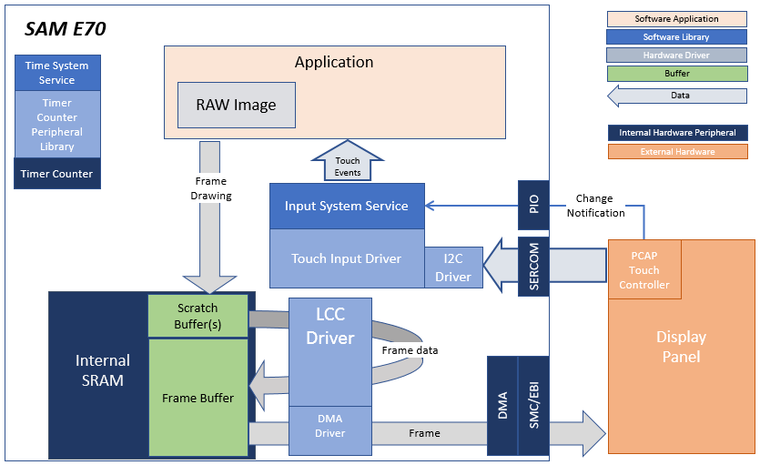
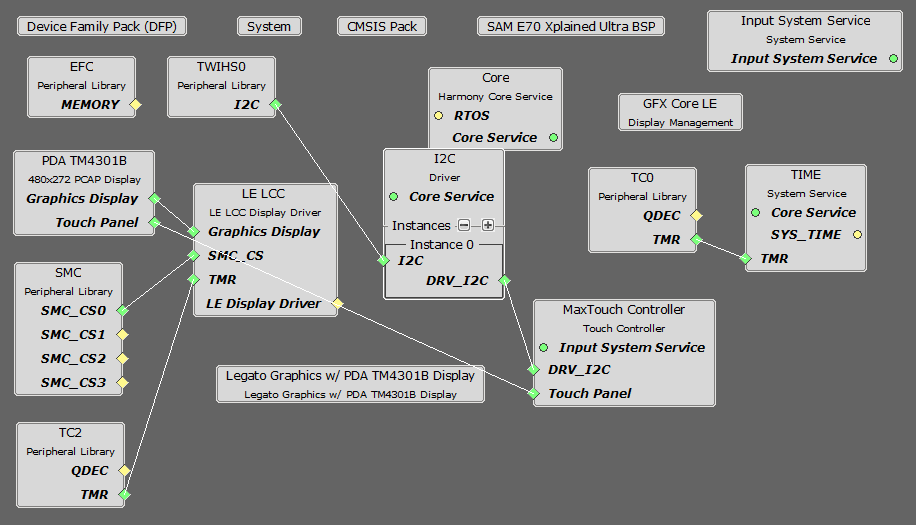
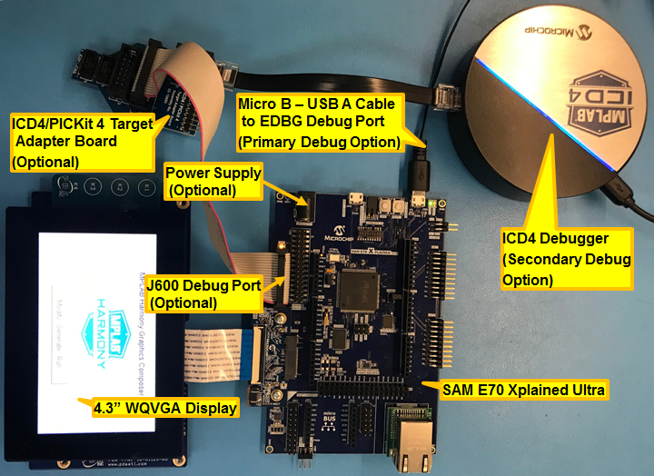
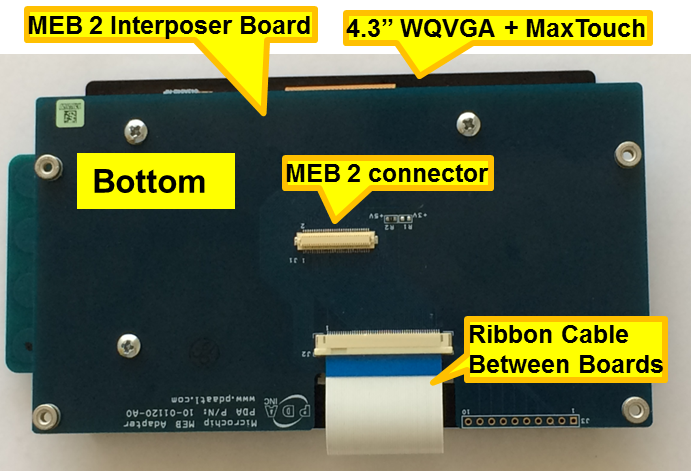

 blank\_quickstart\_e70\_xu\_wqvga.X

Defining the Architecture
-------------------------

In this configuration, a 16-bit RGB565 frame buffer is stored in the internal SRAM. These configurations use the Low Cost Controller-less (LCC) display driver to manage the DMA that transfers the framebuffer contents to the display.

User touch input on the display panel is received thru the PCAP capacitive touch controller, which sends a notification to the Touch Input Driver. The Touch Input Driver reads the touch information over I2C and sends the touch event to the Graphics Library thru the Input System Service.

### Demonstration Features

-   3rd-Party graphics driver abstraction
-   Touch Event Handling
-   DMA System Service
-   Low-Cost Controllerless (LCC) graphics driver
-   16-bit RGB565 color depth support (65535 unique colors)
-   RAW image stored in internal flash

Creating the Project Graph
--------------------------

The Project Graph diagram shows the Harmony components that are included in this application. Lines between components are drawn to satisfy components that depend on a capability that another component provides.

Adding the **SAM E70 Xplained Ultra BSP** and **Legato Graphics w/ PDA TM4301B Display** Graphics Template component into the project graph will automatically add the components needed for a graphics project and resolve their dependencies. It will also configure the pins needed to drive the external peripherals like the display and the touch controller. Remove the Legato Component to complete the setup.

Building the Application
------------------------

The parent directory for this application is gfx/apps/blank\_quickstart. To build this application, use MPLAB X IDE to open the gfx/apps/blank\_quickstart/firmware/blank\_qs\_e70\_xu\_tm4301b.X project file.

The following table lists configuration properties:

|Project Name|BSP Used|Graphics Template Used|Description|
|:-----------|:-------|:---------------------|:----------|
|blank\_qs\_e70\_xu\_tm4301b.X|SAM E70 Xplained Ultra|PDA TM4301b Display|SAM E70 Xplained Ultra board with PDA TM4301B 480x272 (WQVGA) display|

> \*\*\_NOTE:\_\*\* This application may contain custom code that is marked by the comments // START OF CUSTOM CODE ... and // END OF CUSTOM CODE. When using the MPLAB Harmony Configurator to regenerate the application code, use the "ALL" merging strategy and do not remove or replace the custom code.

Configuring the Hardware
------------------------

The final setup should be:

Configuring the 4.3-inch WQVGA Display requires disconnecting the ribbon cable that connects the display to the interposer board.

First, release the ribbon cable from the interposer board. Next, release the black clamp on the E70's J2 connector and turn the display over. Finally, insert the ribbon cable into J2 and close the clamp.

The board and display are powered by a Micro B - USB A cable from PC to the 'Debug USB' port on the E70 board.  The board can be debug via the on-board EDBG.  Optionally, ICD4 Debugger or the ICD4/PICKit4 Adapter Board are connected as shown above.

Running the Demonstration
-------------------------

Once the board is powered on, the application will run and show the following image on the display panel.

* * * * *

 
