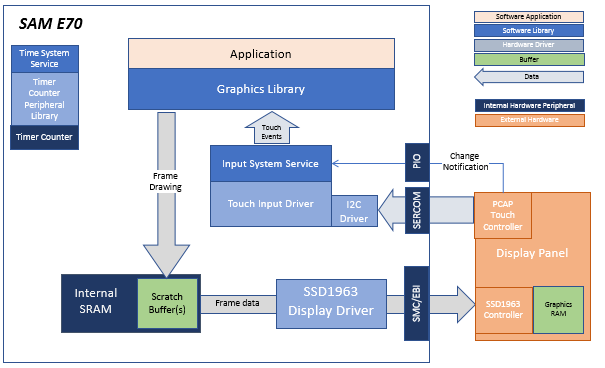
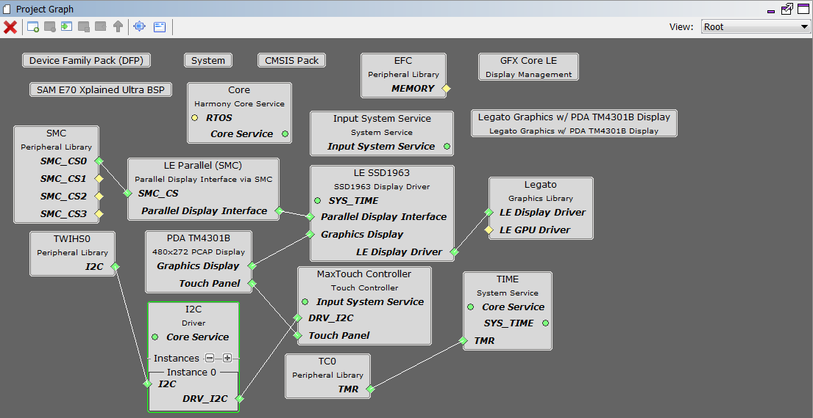
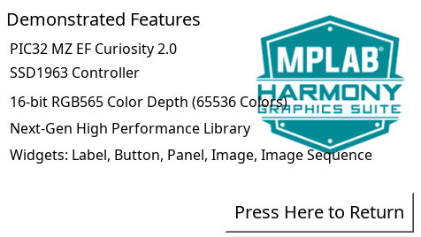

 legato\_adventure\_e70\_xu\_ssd1963\_tm4301.X

Defining the Architecture
-------------------------

The architecture for this configuraiton is the SAM E70 Xplained Ultra + 4.3” WQVGA with SSD1963 GFX Interface Card interface through the 16-bit 8080 mode.

The SSD1963 is connected to the SAM E70 thru the SMC peripheral and GPIOs which are used to send 16-bit parallel data/commands and to bit-bang control signals to the SSD1963 controller, respectively. The frame buffer is stored externally in the SSD1963 controller.

User touch input on the display panel is received thru the PCAP capacitive touch controller, which sends a notification to the Touch Input Driver. The Touch Input Driver reads the touch information over I2C and sends the touch event to the Graphics Library thru the Input System Service.

### Demonstration Features 

* Legato Graphics Library
* Input system service and touch driver
* Time system service, timer-counter peripheral library and driver
* SSD1963 display controller driver
* 16-bit RGB565 color depth support (65535 unique colors)
* EBI peripheral library and driver
* I2C peripheral library and driver
* JPEG image stored in internal flash

Creating the Project Graph
--------------------------

The Project Graph diagram shows the Harmony components that are included in this application. Lines between components are drawn to satisfy components that depend on a capability that another component provides.

Adding the **SAM E70 XPlained Ultra BSP** and **Legato Graphics w/ PDA TM4301B Display** Graphics Template component into the project graph will automatically add the components needed for a graphics project and resolve their dependencies. It will also configure the pins needed to drive the external peripherals like the display and the touch controller.  

Building the Application
------------------------

The parent directory for this application is apps/legato_adventure. To build this application, use MPLAB X IDE open the apps/legato_adventure/firmware/legato_adv_e70_xu_tm4301b.X project file.

The following table lists configuration properties:  

| Project Name  | BSP Used |Graphics Template Used | Description |
|---------------| ---------|---------------| ---------|
| legato_adv_e70_xu_tm4301b_ssd1963.X |SAM E70 Xplained Ultra| Legato Graphics w/ PDA TM4301B Display | Legato GFX on SAM E70 Xplained Ultra board with PDA TM4301B 480x272 (WQVGA) Display and SSD1963 display driver  |

> \*\*\_NOTE:\_\*\* This application may contain custom code that is marked by the comments // START OF CUSTOM CODE ... and // END OF CUSTOM CODE. When using the MPLAB Harmony Configurator to regenerate the application code, use the "ALL" merging strategy and do not remove or replace the custom code.

Configuring the Hardware
------------------------

The final setup should be: 

Running the Demonstration
-------------------------

The application first boots to an animated Splash Screen. Once the Splash Screen animation completes, the application boots to a Main Screen.

When at rest, the demo will cycle through idle sprite animations. Various areas of the screen are touch interactive

If initiated to run, the lamb sprite will run to the end of the screen, and play out a sequence of smacking into a wall, hurt and dizzy animations.

Tap Jump and the lamb will play out a jump animation.

Info Screen describes the features supported by this demo

* * * * *
