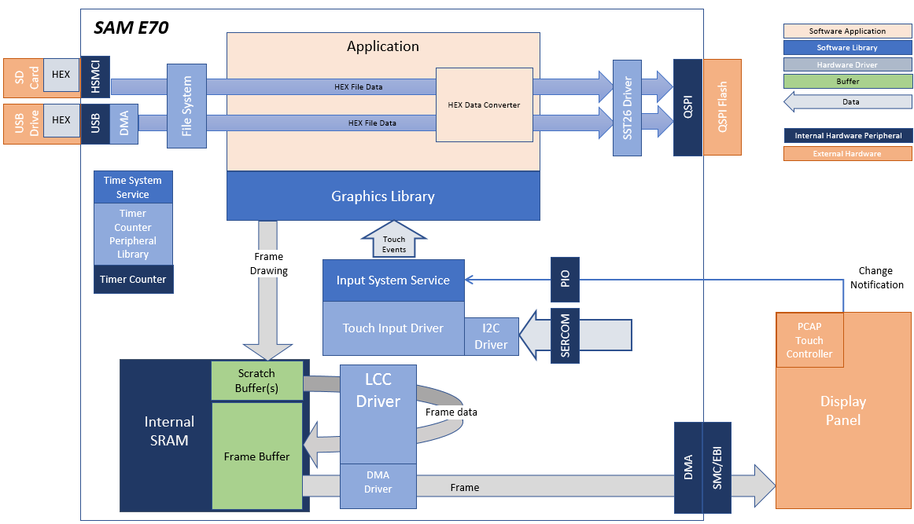
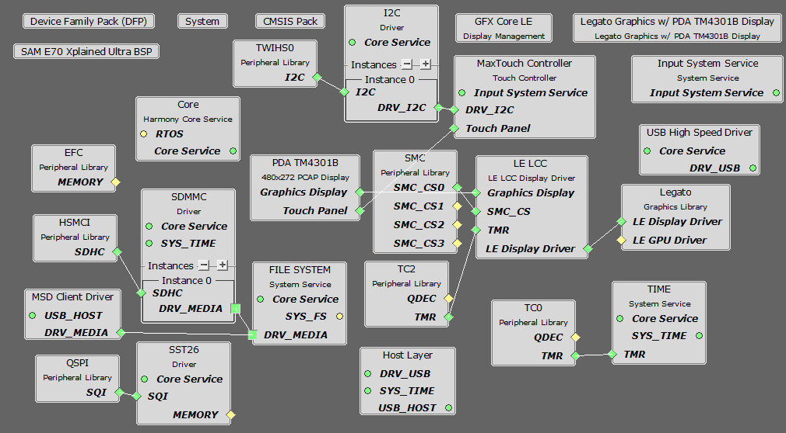
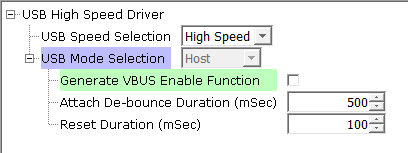
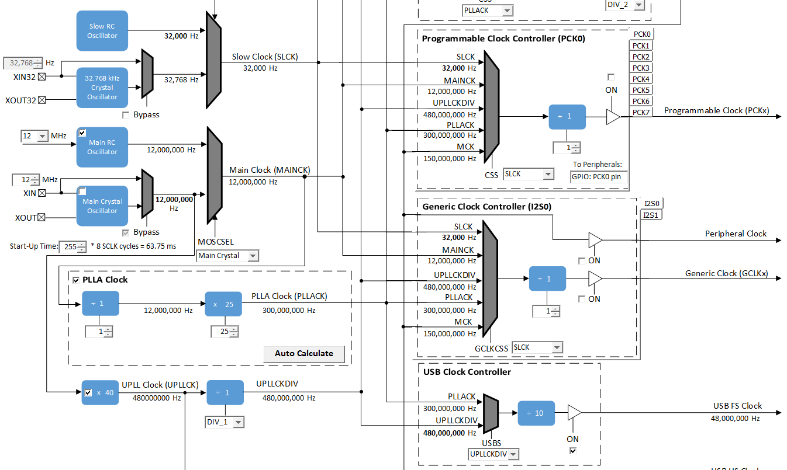
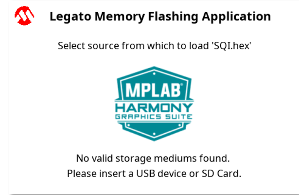
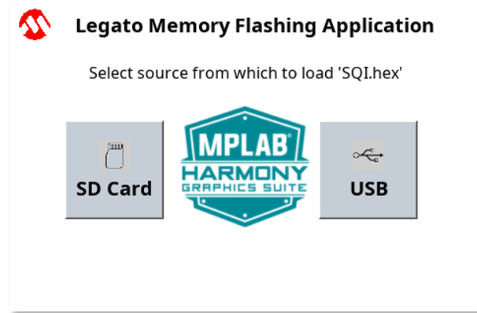
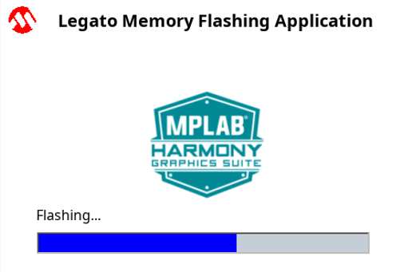

 legato\_flash\_e70\_xu\_wqvga.X

Defining the Architecture
-------------------------

The legato_flash application uses the USB file systems in MPLAB Harmony and the USB driver to scan the MSD for a .hex file with resources and reads them sector by sector and programs the external non-volatile QSPI memory. The Graphics Library is used to render graphics to the display. Using the DMA, the Low-Cost Controllerless (LCC) Display Driver continuously transfers frame data from the frame buffer out to the LCD display.

The application also features user touch input through the integrated touch screen on the display panel. Touch input from the touch controller goes through the I2C port, and the Input System Service acquires the touch input information from the Touch and I2C drivers. The Input System Service sends touch events to the Graphics Library, which processes these events and updates the frame data accordingly.

This configuration runs on the SAM E70 Xplained Ultra with RGB565 GFX Interface board and WQVGA display. Two frame buffers are stored in the internal SRAM in a double buffer configuration, and the Low-Cost Controllerless (LCC) display driver is used to manage the DMA that transfers the read frame buffer contents to the display via the EBI peripheral. The Legato Graphics Library draws the updated sections of the frame to an internal scratch buffer which is used by the LCC display driver to update the frame buffer.

User touch input on the display panel is received thru the PCAP capacitive touch controller, which sends a notification to the Touch Input Driver. The Touch Input Driver reads the touch information over I2C and sends the touch event to the Graphics Library thru the Input System Service.

The USB peripheral is setup in MSD Host mode with the File System service support. It scans for a file named SQI.hex when a USB MSD device is connected. The application reads the hex data from the file and decodes it with a hex decoder into binary data. The binary is written to external non-volatile memory via the QSPI peripheral configured with the SST26 driver.

### Demonstration Features

- Legato Graphics Library
- Input system service and touch driver
- Time system service, timer-counter peripheral library and driver
- Low-Cost Controllerless driver with global palette support
- 16-bit RGB565 color depth
- EBI peripheral library and driver
- I2C peripheral library and driver
- SST26 QSPI driver
- USB MSD driver (Host Mode)
- SD Card driver (supported via SPI)
- File System
- Images and Fonts for user interface stored in internal flash

Creating the Project Graph
--------------------------

The Project Graph diagram shows the Harmony components that are included in this application. Lines between components are drawn to satisfy components that depend on a capability that another component provides.

Adding the **SAM E70 Xplained Ultra BSP** and **Legato Graphics w/ PDA TM4301B Display** Graphics Template component into the project graph will automatically add the components needed for a graphics project and resolve their dependencies. It will also configure the pins needed to drive the external peripherals like the display and the touch controller.

Additional components to support USB, QSPI, HSMCI and SDMMC Driver needs to be added and connected manually.

Some of these components are fine with default settings, while other require some changes. The following is a list of all the components that required custom settings.

Disable VBUS function for USB High Speed Driver

For SPI Flash access, make sure all 6 pins for QSPI is mapped.

To support the SD card reader with the HSMCI peripheral, map the pins as shown.

To drive the USB peripheral, make sure UPLL is enabled with the 40x multiplier, with USB FS Clock output 48 MHz.

Building the Application
------------------------

The parent directory for this application is gfx/apps/legato\_flash. To build this application, use MPLAB X IDE to open the gfx/apps/legato\_flash/firmware/legato\_fl\_e70\_xu\_tm4301b.X project file.

The following table lists configuration properties:

|Project Name|BSP Used|Graphics Template Used|Description|
|:-----------|:-------|:---------------------|:----------|
|blank\_qs\_e70\_xu\_tm4301b.X|SAM E70 Xplained Ultra|PDA TM4301b Display|SAM E70 Xplained Ultra board with PDA TM4301B 480x272 (WQVGA) display|

> \*\*\_NOTE:\_\*\* This application may contain custom code that is marked by the comments // START OF CUSTOM CODE ... and // END OF CUSTOM CODE. When using the MPLAB Harmony Configurator to regenerate the application code, use the "ALL" merging strategy and do not remove or replace the custom code.

Configuring the Hardware
------------------------

The final setup should be:

Configuring the 4.3-inch WQVGA Display requires disconnecting the ribbon cable that connects the display to the interposer board.

First, release the ribbon cable from the interposer board. Next, release the black clamp on the E70's J2 connector and turn the display over. Finally, insert the ribbon cable into J2 and close the clamp.

The board and display are powered by a Micro B - USB A cable from PC to the **Debug USB** port on the E70 board.  The board can be debug via the on-board EDBG.  Optionally, ICD4 Debugger or the ICD4/PICKit4 Adapter Board are connected as shown above.

Connect the USB MSD device to the **Target USB** USB micro port. This can be connected before or at any point after the application is powered-on. 

For media stored on SD MMC device, connect the SD MMC device to the micro SD card slot in the bottom side of the SAM E70 Xplained Ultra board. This can be connected before or at any point after the application is powered-on.

Running the Demonstration
-------------------------

When power-on is successful, without a USB MSD device or SD MMC device attached to the Target USB port or the SD card slot, the demonstration will display a screen with the message **No valid storage mediums found. Please insert a USB device or SD Card**:

If a valid USB MSD device is connected, the display will a USB button. LED1 (red) will light up also.

If a valid SDMMC device is connected, the display will a SD button. LED2 (yellow) will light up also.

**Known Issue:** There is a visual artifact during data transfer when using SD EMMC card.  There is no corruption to the transfer data. 

FAT32 file system format and a valid external resources file named precisely **SQI.hex** Make sure the USB MSD device or the SD MMC device has is copied inside.

Press and release the SD button or the USB button on-screen. The application will initiate the data transfer on release of the button. Depending on the size of SQI.hex file (greater than 500 kilobytes), the application may freeze with no visual feedback, upwards of 30 seconds. It will then display a progress bar to indicate the transfer. The transfer completes when the progress bar is filled. The application will then display a button with **OK**.

* * * * *

 
