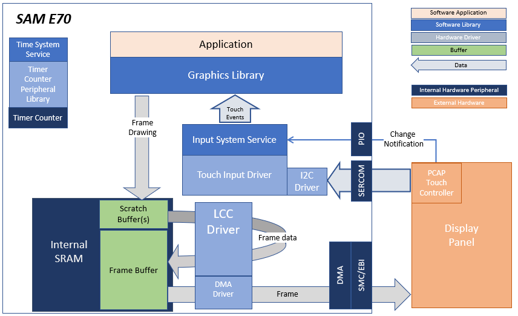
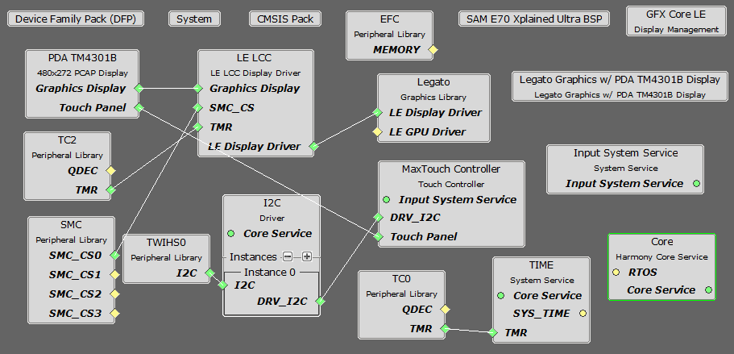
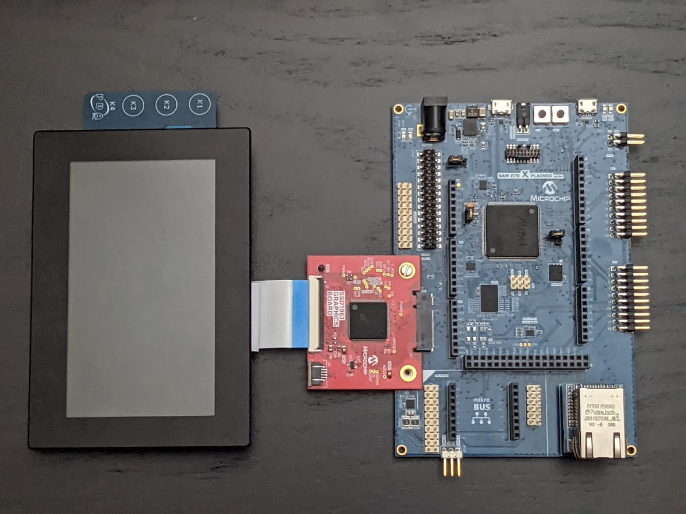

 legato\_quickstart\_e70\_xu\_tm4301.IAR

Defining the Architecture
-------------------------

In this configuration, a 16-bit RGB565 frame buffer is stored in the internal SRAM. These configurations use the Low Cost Controller-less (LCC) display driver to manage the DMA that transfers the framebuffer contents to the display.

User touch input on the display panel is received thru the PCAP capacitive touch controller, which sends a notification to the Touch Input Driver. The Touch Input Driver reads the touch information over I2C and sends the touch event to the Graphics Library thru the Input System Service.

### Demonstration Features 

* Legato Graphics Library
* Input system service and driver
* Time system service, timer-counter peripheral library and driver
* DMA System Service
* Low-Cost Controllerless (LCC) graphics driver
* I2C driver
* 16-bit RGB565 color depth support (65535 unique colors)
* JPEG image stored in internal flash

Creating the Project Graph
--------------------------

The Project Graph diagram shows the Harmony components that are included in this application. Lines between components are drawn to satisfy components that depend on a capability that another component provides.

Adding the **SAM E70 XPlained Ultra BSP** and **Legato Graphics w/ PDA TM4301B Display** Graphics Template component into the project graph will automatically add the components needed for a graphics project and resolve their dependencies. It will also configure the pins needed to drive the external peripherals like the display and the touch controller.  

Building the Application
------------------------

The parent directory for this application is legato_quickstart. To build this application, use IAR EW for ARM open the legato_quickstart/firmware/legato_qs_e70_xu_tm4301b.IAR project file.

The following table lists configuration properties:  

| Project Name  | BSP Used |Graphics Template Used | Description |
|---------------| ---------|---------------| ---------|
| legato_qs_e70_xu_tm4301b.IAR | sam_e70_xplained_ultra | Legato graphics w/ PDA TM4301b Display | SAM E70 Xplained Ultra board with PDA TM4301B 480x272 (WQVGA) Display |

> \*\*\_NOTE:\_\*\* This application may contain custom code that is marked by the comments // START OF CUSTOM CODE ... and // END OF CUSTOM CODE. When using the MPLAB Harmony Configurator to regenerate the application code, use the "ALL" merging strategy and do not remove or replace the custom code.

Configuring the Hardware
------------------------

The final setup should be: 

The board and display are powered by a Micro B USB A cable from PC to the **Debug USB** port on the E70 board.

In IAR, make sure the debugger setting is pointed to CMSIS DAP.

**Download and Debug** to deploy to the device.

Running the Demonstration
-------------------------

When power-on is successful, the demonstration will display a similar menu to that shown in the following figure (different configurations may have slight variation in the screen aspect ratio):

The icon **Quick Start** is a touch button that changes when pressed.

* * * * *
