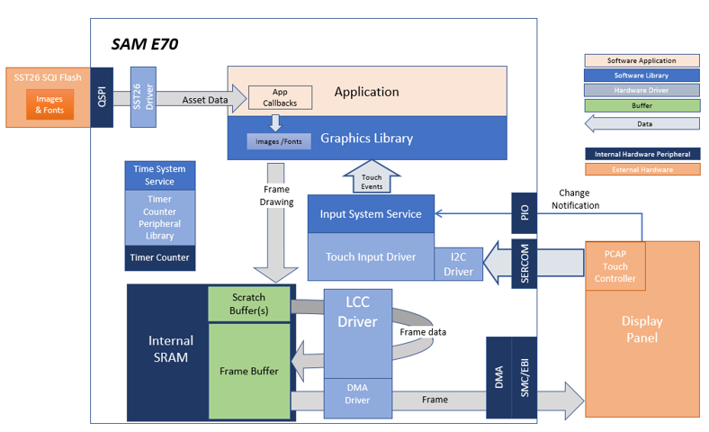
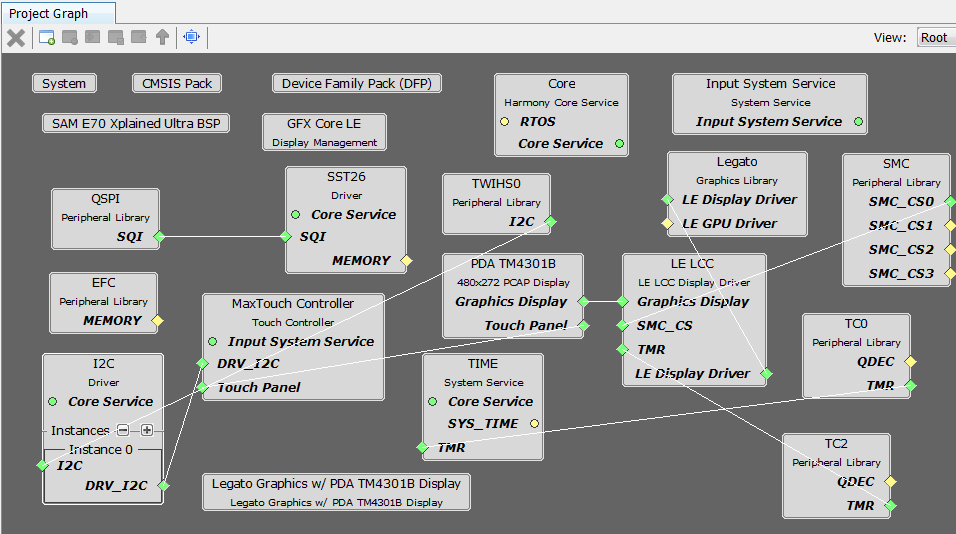
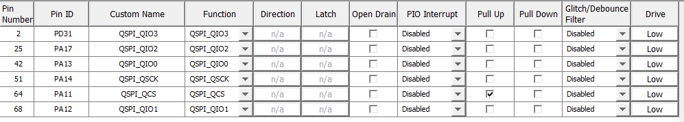
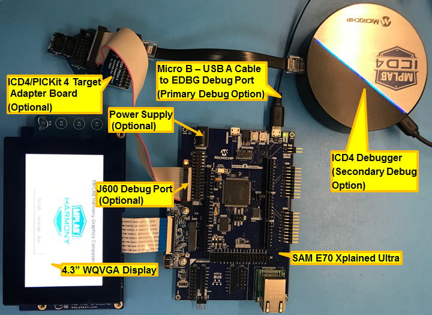
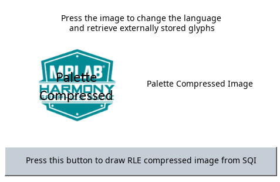

 legato\_quickstart\_external\_resources\_e70\_xu\_wqvga.X

Defining the Architecture
-------------------------

The legato_quickstart_external_resources (external flash reader) application reads previously programmed binary data from the external non-volatile QSPI memory. The Graphics Library is used to render graphics to the scratch buffer.   Using the DMA, the Low-Cost Controllerless (LCC) Display Driver continuously transfers frame data from the frame buffer out to the LCD display.

This configuration runs on the SAM E70 Xplained Ultra with RGB565 GFX Interface board and WQVGA display. Two frame buffers are stored in the internal SRAM in a double buffer configuration, and the Low-Cost Controllerless (LCC) display driver is used to manage the DMA that transfers the read frame buffer contents to the display via the EBI peripheral. The Legato Graphics Library draws the updated sections of the frame to an internal scratch buffer which is used by the LCC display driver to update the frame buffer.

User touch input on the display panel is received thru the PCAP capacitive touch controller, which sends a notification to the Touch Input Driver. The Touch Input Driver reads the touch information over I2C and sends the touch event to the Graphics Library thru the Input System Service.

### Demonstration Features

- Legato Graphics Library
- Input system service and touch driver
- Time system service, timer-counter peripheral library and driver
- Low-Cost Controllerless driver with global palette support
- 16-bit RGB565 color depth
- EBI peripheral library and driver
- I2C peripheral library and driver
- SST26 QSPI driver
- Images and Fonts for user interface stored in internal and external NVM memory

Creating the Project Graph
--------------------------

The Project Graph diagram shows the Harmony components that are included in this application. Lines between components are drawn to satisfy components that depend on a capability that another component provides.

Adding the **SAM E70 Xplained Ultra BSP** and **Legato Graphics w/ PDA TM4301B Display** Graphics Template component into the project graph will automatically add the components needed for a graphics project and resolve their dependencies. It will also configure the pins needed to drive the external peripherals like the display and the touch controller.

Additional components to support QSPI and SST26 needs to be added and connected manually. For QSPI access, make sure all 6 pins for QSPI is mapped.

Building the Application
------------------------

The parent directory for this application is gfx/apps/legato\_quickstart\_ext\_res\. To build this application, use MPLAB X IDE to open the gfx/apps/legato\_quickstart\_ext\_res\/firmware/legato\_qs\_e70\_xu\_tm4301b.X project file.

The following table lists configuration properties:

|Project Name|BSP Used|Graphics Template Used|Description|
|:-----------|:-------|:---------------------|:----------|
|blank\_qs\_e70\_xu\_tm4301b.X|SAM E70 Xplained Ultra|PDA TM4301b Display|SAM E70 Xplained Ultra board with PDA TM4301B 480x272 (WQVGA) display|

> \*\*\_NOTE:\_\*\* This application may contain custom code that is marked by the comments // START OF CUSTOM CODE ... and // END OF CUSTOM CODE. When using the MPLAB Harmony Configurator to regenerate the application code, use the "ALL" merging strategy and do not remove or replace the custom code.

Configuring the Hardware
------------------------

The final setup should be:

Configuring the 4.3-inch WQVGA Display requires disconnecting the ribbon cable that connects the display to the interposer board.

First, release the ribbon cable from the interposer board. Next, release the black clamp on the E70's J2 connector and turn the display over. Finally, insert the ribbon cable into J2 and close the clamp.

The board and display are powered by a Micro B - USB A cable from PC to the **Debug USB** port on the E70 board.  The board can be debug via the on-board EDBG.  Optionally, ICD4 Debugger or the ICD4/PICKit4 Adapter Board are connected as shown above.

Running the Demonstration
-------------------------

When power-on is successful, the following screen will appear on the display

Pressing the button will cause the application to load a new image. The image cycles in order from Uncompressed RAW with Direct Blit, Uncompressed RAW, Run-Length Encoded (RLE) RAW, to JPEG.

The MPLAB Harmony Graphics Suite logo is also a button. Pressing the logo will toggle the application between English and Simplified Chinese.

Note that all images and glyphs are retrieved from external NVM via QSPI. The application is purposely setup in single-buffer configuration to allow visual inspection of the data retrieval speed of the various images and glyphs.

* * * * *

 
